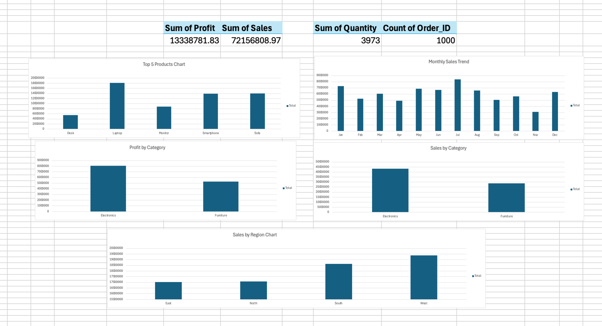

# 📊 E-Commerce Sales Analysis

An end-to-end **E-Commerce Sales Analysis project** built using **Python, Pandas, SQL, SQLite, and Excel** to analyze sales, profit, products, customers, and regional performance.

## 🚀 Project Overview

This project analyzes **1,000 e-commerce orders** and converts raw sales data into useful business insights.

### Business Questions

- How much total sales and profit were generated?
- Which categories generate the most sales and profit?
- Which regions perform best?
- Which products generate the highest sales?
- How do sales change month by month?
- Which customers contribute the most sales?
- What are the profit margins by category?

## 🛠️ Tech Stack

| Tool | Purpose |
|---|---|
| 🐍 Python | Data analysis |
| 🐼 Pandas | Data processing |
| 🗄️ SQL | Business analysis |
| 🟢 SQLite | Database |
| 📊 Excel | Dashboard & visualization |
| 🔧 Git | Version control |
| 🐙 GitHub | Project hosting |

## 📁 Dataset

The dataset contains **1,000 orders** and **9 columns**:

```text
Order_ID
Order_Date
Customer_Name
Category
Product
Region
Quantity
Sales
Profit
```

## 📈 Key KPIs

| KPI | Result |
|---|---:|
| 💰 Total Sales | 72,156,808.97 |
| 📈 Total Profit | 13,338,781.83 |
| 🛒 Total Orders | 1,000 |
| 📦 Total Quantity | 3,973 |
| 💵 Average Order Value | 72,156.81 |

## 🔍 Analysis Performed

### Python

- Data inspection
- Data type checking
- Duplicate checking
- Sales analysis
- Profit analysis
- Category analysis
- Regional analysis
- Product analysis
- Monthly sales analysis
- KPI calculation

### SQL

- Total Sales
- Total Profit
- Total Orders
- Total Quantity
- Average Order Value
- Sales by Category
- Profit by Category
- Sales by Region
- Top 5 Products
- Monthly Sales
- Top 5 Customers
- Profit Margin by Category
- Region + Category Sales

## 📊 Excel Dashboard

The Excel dashboard includes:

- Total Sales
- Total Profit
- Total Orders
- Total Quantity
- Sales by Category
- Sales by Region
- Monthly Sales Trend
- Profit by Category
- Top 5 Products by Sales

### Dashboard Preview



## 💡 Key Business Insights

- **Electronics** generated higher sales and profit than Furniture.
- **West** recorded the highest regional sales.
- **Laptop** was the top-selling product.
- **July** recorded the highest monthly sales.
- The dataset contains **1,000 orders** with **no duplicate rows**.

## 📂 Project Structure

```text
Ecommerce-Sales-Analysis/
│
├── analysis.py
├── analysis.sql
├── ecommerce_sales.db
├── ecommerce_sales_analysis_recovered.csv
├── dashboard.png
└── README.md
```

## 🔄 Data Analytics Workflow

```text
Raw Data
   ↓
Python / Pandas
   ↓
Data Analysis
   ↓
SQL / SQLite
   ↓
Excel Dashboard
   ↓
Business Insights
   ↓
GitHub Portfolio
```

## 🎯 Skills Demonstrated

- Python
- Pandas
- SQL
- SQLite
- Excel
- Exploratory Data Analysis
- KPI Analysis
- Data Visualization
- Business Insights
- Git & GitHub

## 👨‍💻 Author

**Sahil Yadav**

B.Tech Computer Science Student  
Interested in **Data Analytics, SQL, Python, Excel & Business Intelligence**.

---

⭐ This project demonstrates an end-to-end approach to turning raw e-commerce data into actionable business insights.
